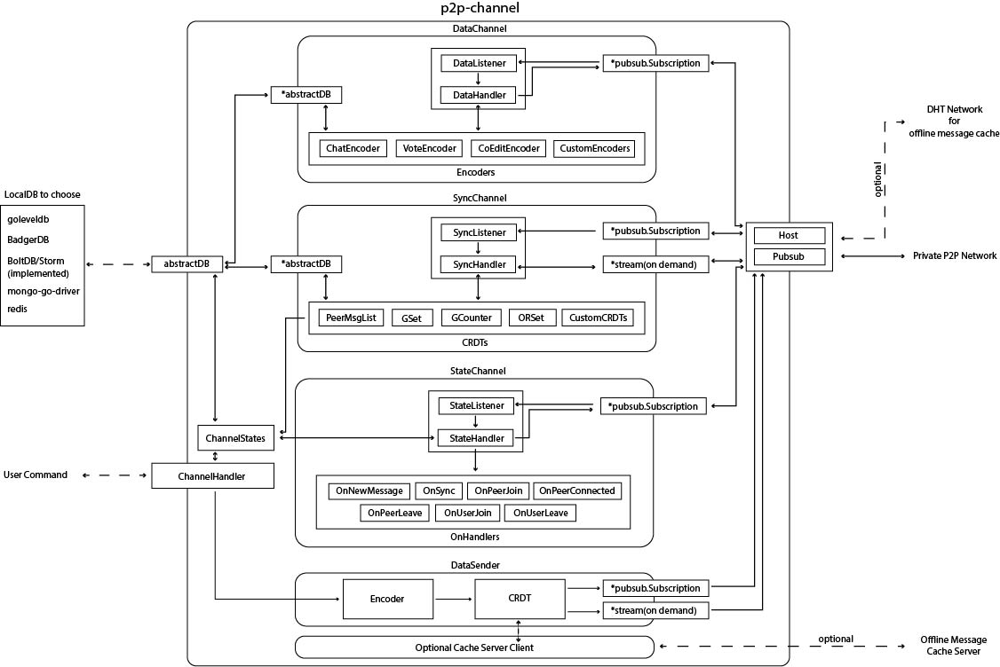

# p2p-channel

Introduction:
Channel is a pubsub channel with synchronization abilities and eventual message consistency.
It is built upon libp2p and a local database without any other 3rd party dependencies.
It used operational based CRDT for message synchronization to achieve less network traffic.
It used state base CRDT for state synchronization to sustain peers state info.
It has the ability to sync not only from the author, but from any peer which have
better information about another peer. Thus it made it simpler to give offline message
ability to a p2p pubsub system without a centralized server for offline message pushing.
With an event based interface, it can be easily extended for other applications.
Currently it only supports storm(BoltDB) in golang as the local database, it could expand
to accept more local or embedded database in future update. It also need to support potential
outside server as a method to provide full offline message ability.

Usage:
It can be used to support various applications that needs consistency and offline capabilities
such as chatroom, internet forum, co-edit document, p2p database, etc.

Author: Ziwei Wei
Date: Dec 1, 2019
Version: 0.1

Plan for version 0.2:


TODO:
1. refractor code according to design
2. clean wacky commends, make comments better
3. build more solid tests

To test run

```console
go test ./...
```
